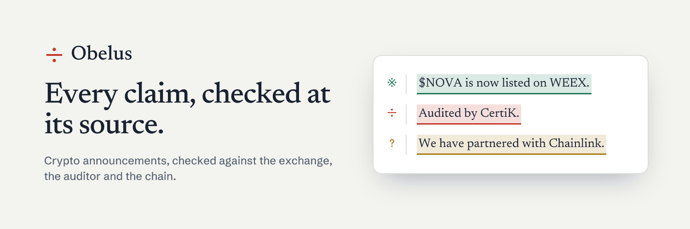

# Obelus



Obelus fact-checks crypto announcements one claim at a time. Paste an X post, a press-release link or
the text itself. Obelus pulls out every checkable claim ("listed on WEEX", "audited by CertiK",
"ownership renounced", "partnered with LambdaClass"), checks each one against **the one source that can
confirm it**, and marks it **verified**, **contradicted** or **unverified**. Every mark comes with a link to
its proof, and every report gets a tamper-evident receipt on Base.

- **Live:** https://obelus-five.vercel.app
- **Telegram:** [@Obelus_the_Bot](https://t.me/Obelus_the_Bot) — `/check <link or text>`, or reply `/check` to a message
- **Built for** the Orion Builder Hackathon (Base)

> The obelus (÷) is the mark scholars at the Library of Alexandria drew in the margin beside a line they
> judged false. Obelus puts the same mark beside crypto announcements.

## Why

Chainstory analysed 2,893 crypto press releases (reported by CoinDesk). Only about 2% contained meaningful
news, and more than 60% promoted projects showing signs of fraud. Paid wires push one release to dozens
of sites, so one false claim ends up looking like coverage everywhere. The usual fakes are exchange
listings, audits, partnerships, "liquidity locked" and "ownership renounced". Each of these can be
checked with the exchange, the auditor, the partner or the chain. Nobody does it, because by hand it
takes an afternoon.

## The rule: the model reads, code decides

- A language model does one job: it pulls the claims out of the text, each with an exact quote. A code
  guard drops any "claim" whose quote isn't in the source word for word.
- Every verdict comes from deterministic code reading a primary source. The model never assigns a verdict,
  produces a number or names a source.
- **Absence of proof is unverified, never contradicted.** Contradicted needs a primary source that
  positively says otherwise, such as CertiK's own page reading "Not Audited By CertiK" or an exchange's
  own API showing the market delisted.
- **An unreachable source is never an answer.** Timeouts, rate limits and region blocks (HTTP 451, 403
  or 429) produce unverified with the HTTP status shown, never a verdict.
- Fetched pages are treated as untrusted data, never as instructions.

## How it works

```
input (X post · web page · text)
  │
  ├─ 1. INGEST     FxTwitter → oEmbed fallback · page fetch · pasted text
  ├─ 2. EXTRACT    LLM → claims with exact quotes (Zod-validated, quote-guarded)
  ├─ 3. RESOLVE    no contract stated? find it on Base via DexScreener
  ├─ 4. CHECK      one deterministic checker per claim type, in parallel, cached
  ├─ 5. REPORT     summary built by code · canonical JSON → keccak256 reportHash
  └─ 6. ANCHOR     EAS attestation on Base · report stored → /r/<id>
```

The decision trace streams live to the page as each step runs. Each report has a budget of 12 tool
calls. Anything left unfinished is marked unverified with the reason `BUDGET_EXHAUSTED`.

## Sources

| Claim | Primary source | Verified when | Contradicted when |
|---|---|---|---|
| Exchange listing | WEEX `v3/exchangeInfo` + `v3/coins` | market trading **and** WEEX's listed contract matches | delisted, or **same ticker, different contract** |
| | BingX `spot/v1/common/symbols` | `status === 1` (live) | delisted (`status 0`) |
| | Binance, Bybit, OKX, MEXC public REST | symbol trading | delisted; for MEXC, which lists only live markets, also absent |
| Audit | CertiK Skynet project page | audit history listed | page shows "Not Audited By CertiK" |
| | Hacken, SlowMist, OpenZeppelin, Quantstamp, Halborn, Cyfrin, Zellic, Trail of Bits, Code4rena, Sherlock (auditor's own domain) | auditor's own site names the project in audit terms | never (absence is not proof) |
| Ownership renounced | Base RPC: `owner()`, EIP-1967 admin slot | owner is the zero address, no proxy admin | a live owner or upgradeable proxy |
| Liquidity lock | DexScreener top pair + Base RPC (one Multicall3 call) | LP held by UNCX (Base) or burned | never (an unknown locker isn't proof of no lock) |
| Partnership | the partner's own official domain (50 partners, each domain checked live) | partner's site names the project in partnership terms | never |
| TVL | DefiLlama `/tvl/<slug>` | within ±25% (or above a "crossed $X" floor) | off by more than that |

BingX publishes no contract address on any public endpoint, so a BingX listing can only be verified as
"ticker listed, contract unconfirmed". WEEX does publish contract addresses. That makes WEEX the one
place Obelus can catch the flagship scam: a real ticker attached to a different token.

Future-tense claims ("will list on Binance next month") are marked unverified `FUTURE_CLAIM`, and Obelus
also shows what the exchange says today.

You can also just ask: **"Is $PEPE listed on MEXC?"** or **"is $BTC listed?"**. Code reads the ticker and
the exchanges named (all six if none are named) and asks each exchange's API directly, with no model
call. The answer comes back as a normal report, one card per exchange, with the same proof links.

## Real runs

I ran Obelus through the live site on 22 real announcements from Chainwire, openPR, CoinGabbar,
Cryptopolitan and BingX Learn, on Sep 23, 2026. The results are in [`fixtures/real/`](fixtures/real).

| | |
|---|---|
| Announcements checked | 20 of 22 (one page was gone, one blocked the fetch) |
| Claims extracted | 104 |
| Checkable against a primary source | 34 |
| Verified | 3 |
| Contradicted | 0 |
| Unverified (the one source that could confirm it doesn't) | 31 |
| Not a kind Obelus can check yet (price talk, roadmaps, "leading", …) | 70 |
| Unverified because a source was unreachable | 0 |
| Median time per check | ~3–5 s |

Two thirds of what press releases claim can't be checked against anything. Of the claims that can be
checked, 31 of 34 went unconfirmed by the one source that could have confirmed them. One example is a
release describing a project as "CertiK-audited" when CertiK has no record of it. That is **not** the same
as false, and Obelus says so on every report.

A second, targeted batch re-checked six 2025 listing announcements ([`results-3.json`](fixtures/real/results-3.json)).
Apex Fusion's March 2025 release, "AP3X Token Listed on MEXC", is still carried by Chainwire, Crypto
Times and Blockster, and Obelus marks the claim **contradicted** on all three: MEXC's full symbol list has
no AP3X market. CoinGecko independently shows AP3X trading only on DEXes. The release was true when it
was published. Obelus catches that the claim no longer holds, which is exactly what a buyer reading it
today needs to know. The other three releases announced future listings ("will list"). Obelus marks
those unverified `FUTURE_CLAIM` and notes that each token is now trading on MEXC.

**Examples** (each opens a pre-run report; more at [`/examples`](https://obelus-five.vercel.app/examples)):

- **A — real, clean:** [Trusted Smart Chain's CertiK audit release](https://obelus-five.vercel.app/r/5zvwvrM6FR). The audit is confirmed on CertiK's own page.
- **B — real, doesn't hold up:** [Apex Fusion's AP3X listing release](https://obelus-five.vercel.app/r/ArfJ6uZePE). It says AP3X is listed on MEXC, and MEXC's own list no longer has it.
- Also real: [Aligned's $ALIGN launch](https://obelus-five.vercel.app/r/f0uh4Plxvf). LambdaClass's own site confirms the partnership.
- **C — labelled test:** [a test announcement about AERO](https://obelus-five.vercel.app/r/srezxyJ1aX), written by the Obelus team to show all three marks in one run. Among other claims, CertiK's own page contradicts "audited by CertiK". The report is labelled as a test everywhere it appears.

## Receipts

Each report is canonicalised (sorted-key JSON, without the receipt itself) and hashed with keccak256. The
hash, the report URL and the verdict counts are attested with [EAS](https://attest.org) using this schema:

```
bytes32 reportHash, string reportUrl, uint8 verified, uint8 contradicted, uint8 unverified, string engineVersion
```

Open `/r/<id>/verify` on any report: your browser re-hashes the report and reads the attestation straight
from Base's public RPC, so the comparison doesn't depend on Obelus's word. Change one character of the
report and the hashes stop matching.

`EAS_CHAIN` selects the network: `base-sepolia` for testing, `base` for mainnet. Each report records the
network its receipt is on.

## The site

| Page | What it's for |
|---|---|
| `/` | Check box, and a live example of a checked announcement |
| `/check` | The check tool on its own, with what you can paste |
| `/r/<id>` | A report: the announcement with each claim highlighted and marked in the margin; click a claim for its proof |
| `/r/<id>/verify` | Re-hashes the report in your browser and compares it with the receipt on Base |
| `/examples` | Real reports, listing questions and the labelled test |
| `/how-it-works` | What counts as proof for each kind of claim |
| `/status` | Which sources are answering right now |
| `/developers` | The API, receipt verification and the Telegram bot |

Long web pages come with menus and footers. The report folds stretches with no claims in them, one
click away, so the claims are what you see.

## API

| Route | Method | |
|---|---|---|
| `/api/check` | POST `{ "input": "<url or text>" }` | Runs a check. Streams trace events (SSE) and ends with `{ reportId }` |
| `/api/report/<id>` | GET | The full report JSON: claims, verdicts, evidence, receipt |
| `/api/health` | GET | Live status of every upstream source |
| `/api/telegram` | POST | Telegram webhook |

Other agents can call `/api/check` directly. The rate limit is 10 checks per IP per hour.

## Deliberately not built in v1

- **Searching X history.** Anonymous X search is locked, so Obelus reads specific post URLs only.
- **Reading audit PDFs** to confirm an audit covered *this* contract.
- **Confirming the token behind a BingX, Binance, Bybit, OKX or MEXC listing.** None of them publish contract addresses publicly; WEEX does.
- **Lockers beyond UNCX on Base**, and Uniswap v3 NFT locks.
- **Chains other than Base** for on-chain checks.
- **Checking partners outside the 50-entry registry.** Obelus won't guess which domain speaks for a company, because one wrong domain would let a fake partnership verify.

## Run it locally

Requires Node 22+ and pnpm.

```bash
pnpm install
cp .env.example .env.local   # then fill in the keys you have
pnpm dev                     # http://localhost:3000
```

With no keys, Obelus runs with an in-memory store, and extraction reports itself as unavailable. The
minimum for a real check is one LLM key (`GROQ_API_KEY` or `GEMINI_API_KEY`, both have free tiers).
`TAVILY_API_KEY` enables the partnership check and the fallback audit check. Upstash Redis, the Telegram
token and the attester key are optional. Every variable is documented in
[`.env.example`](.env.example).

```bash
pnpm test                                   # 210 tests, no network
pnpm typecheck
pnpm fixture fixtures/sample1.txt          # run one input through the full pipeline
```

## Layout

```
app/                 Next.js pages and API routes (see "The site" above), app/_components/ for the UI
src/lib/             pipeline, ingest, extraction, resolve, hashing, EAS, store, summary
src/checkers/        one file per claim type; exchange/ holds WEEX, BingX and the direct-REST exchanges
src/registry/        exchanges, auditors, partners and lockers: curated JSON, each entry verified
src/bot/             Telegram bot (grammY)
scripts/             batch runner, schema registration, webhook setup, domain verification
fixtures/real/       the real announcements above, with their results
architecture.md      full design; Progress.md is the build log
```

Stack: Next.js 15, TypeScript, Zod, viem, grammY, Upstash, Tavily, and Groq or Gemini for extraction.
Deployed on Vercel in Frankfurt (`fra1`), because Binance and Bybit refuse requests from US regions.
